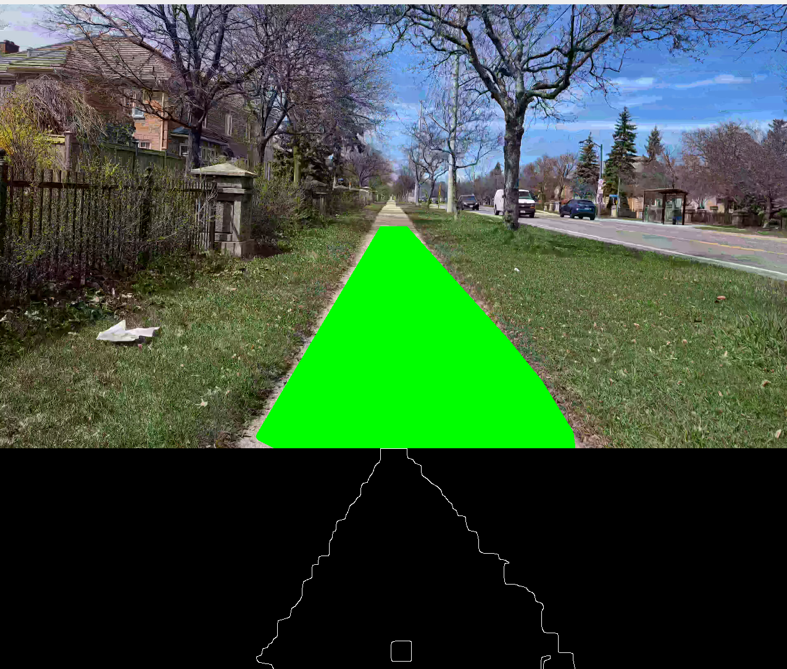
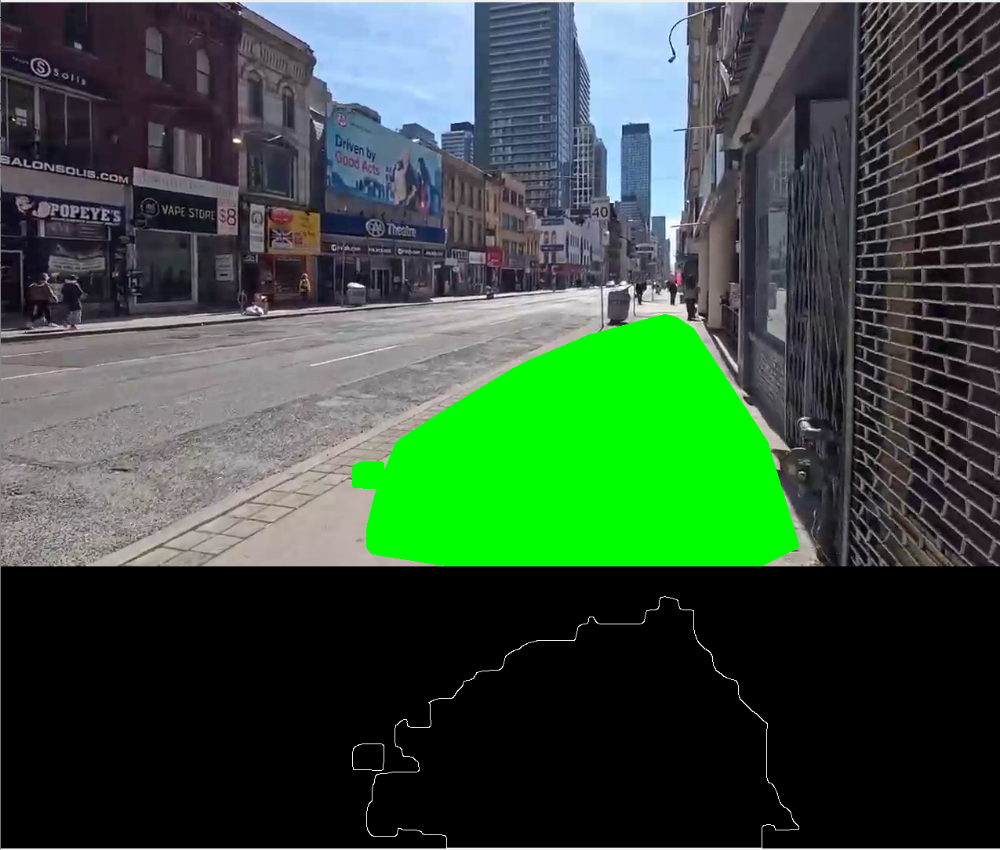
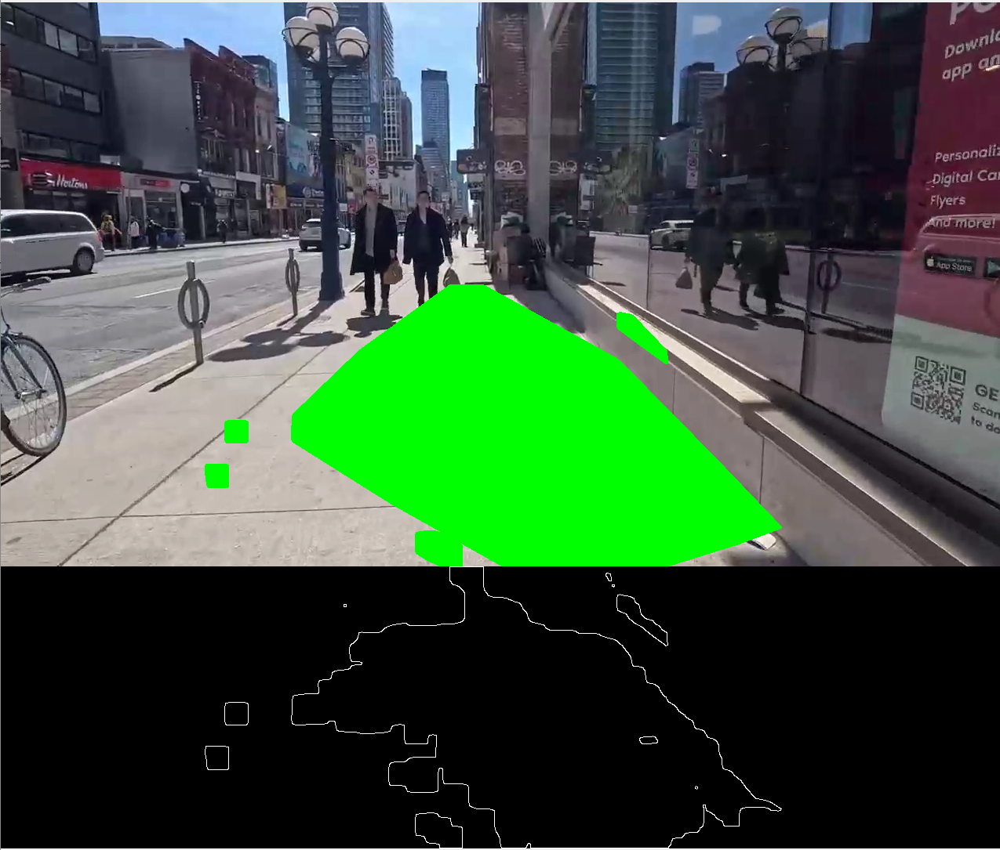
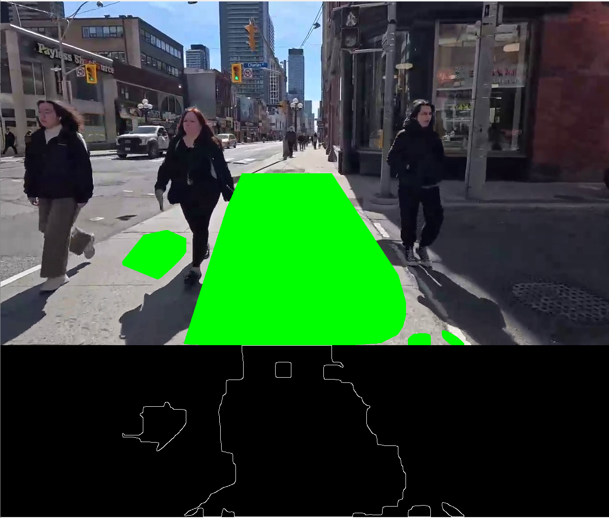

# Path domain via color blob
## Overview

This project provides a set of Python scripts to detect and highlight navigable paths in video frames using color blob detection. The primary focus is on identifying regions of interest based on specific color ranges, detecting contours, and visualizing the results.

## Features

- Interactive adjustment of HSV color thresholds using OpenCV trackbars.
- Real-time video processing to detect and highlight navigable paths.
- Extraction of dominant floor colors to dynamically adapt detection thresholds.
- Visualization of detected paths and key regions for debugging and analysis.

## Usage

1. **Run the script**: Execute the script to process a video file specified in the `video_path` variable.
2. **Adjust HSV values**: Use the trackbars to adjust the HSV values interactively.
3. **Pause/Resume**: Press 'p' to pause or resume the video processing.
4. **Quit**: Press 'q' to quit the application.

## Demo

Below are some images demonstrating the application in action. The images show the original frame on the top half and the processed frame with the applied mask on the bottom half.

### Sidewalk Detection


### Toronto Video Frame 1


### Toronto Video Frame 2


### Toronto Video Frame 3


In each image, the lower half shows the mask applied to highlight the navigable path regions based on the specified color thresholds.

## Dependencies

- OpenCV (cv2)
- NumPy

## Instructions

1. Install the required dependencies:
    ```bash
    pip install opencv-python-headless numpy
    ```
2. Run the script:
    ```bash
    python color_helper.py
    ```

## License

This project is licensed under the MIT License.
