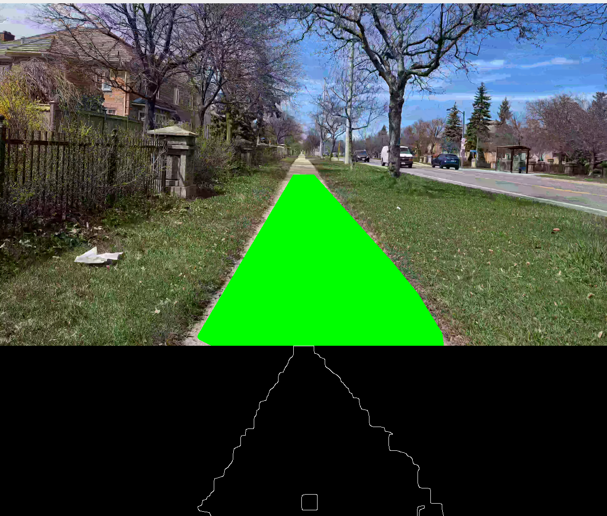
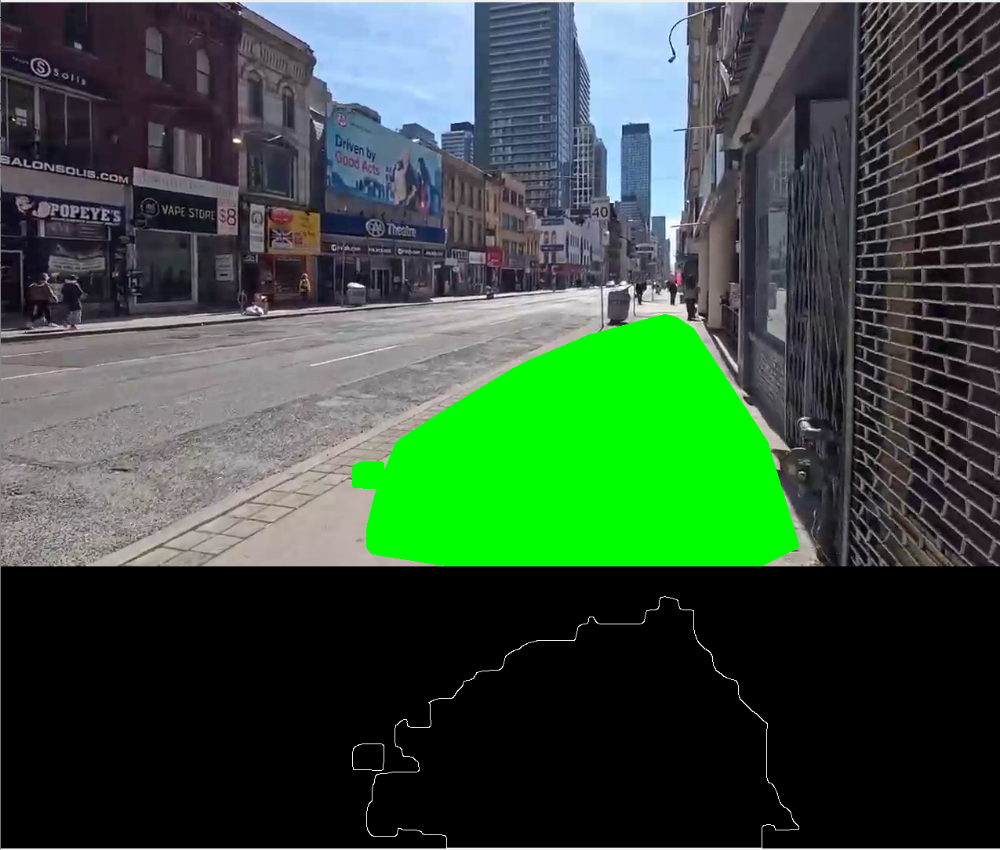
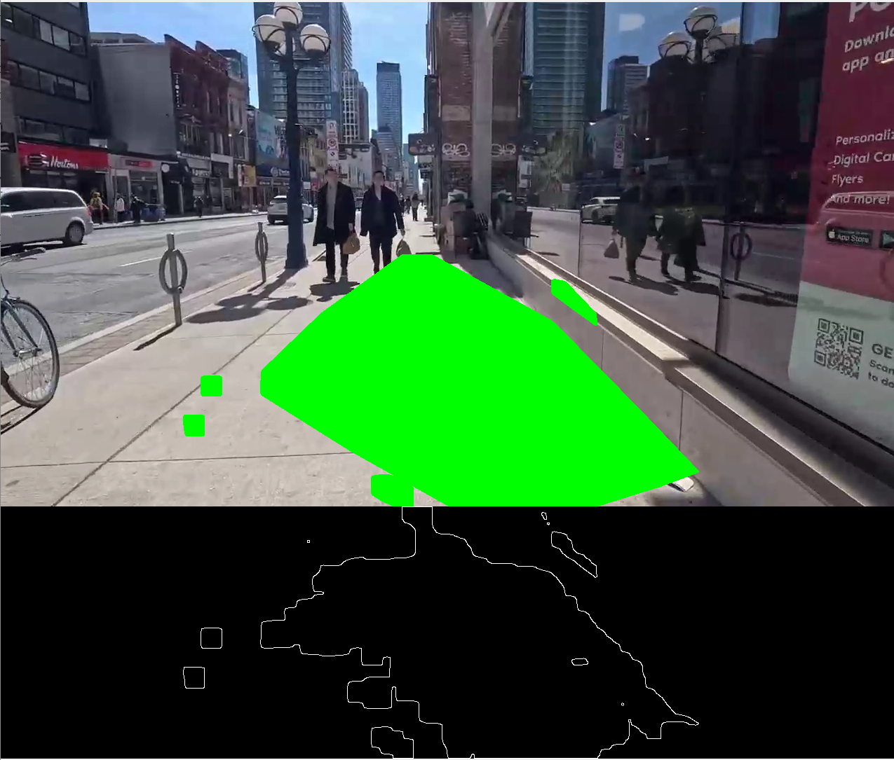
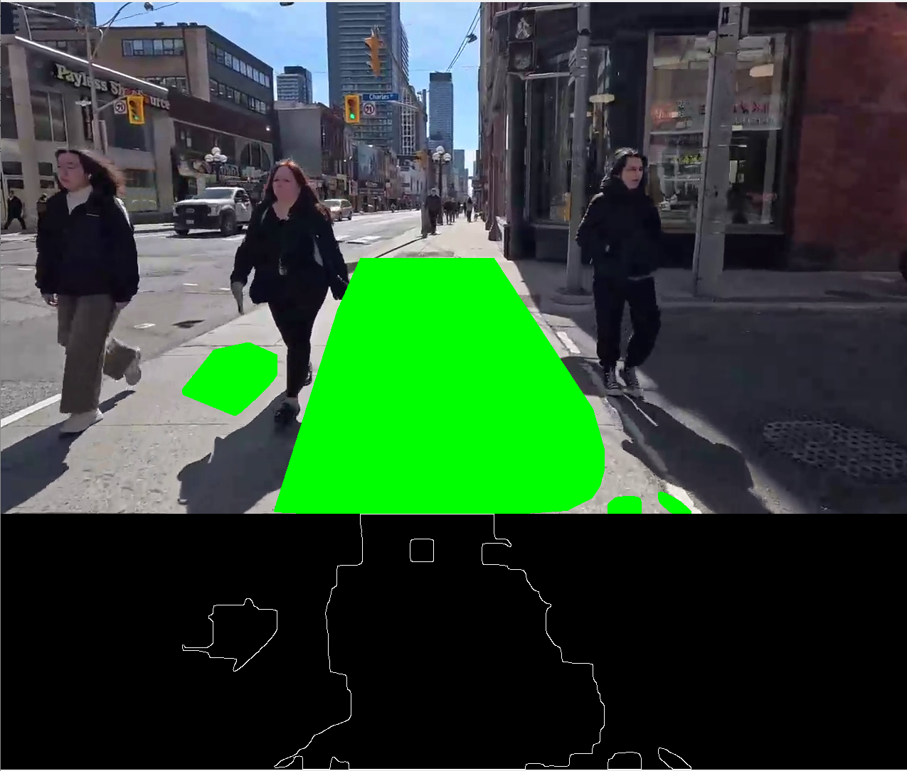
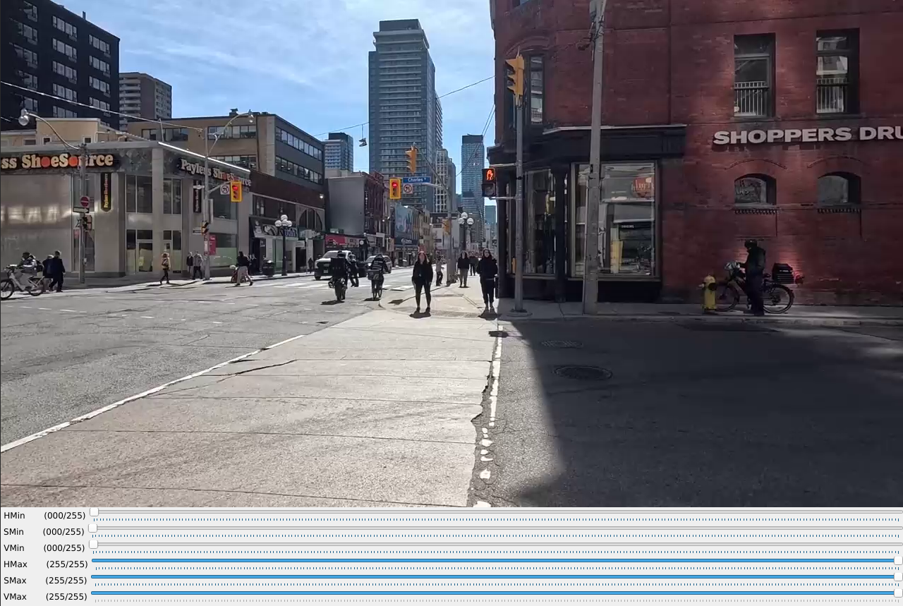
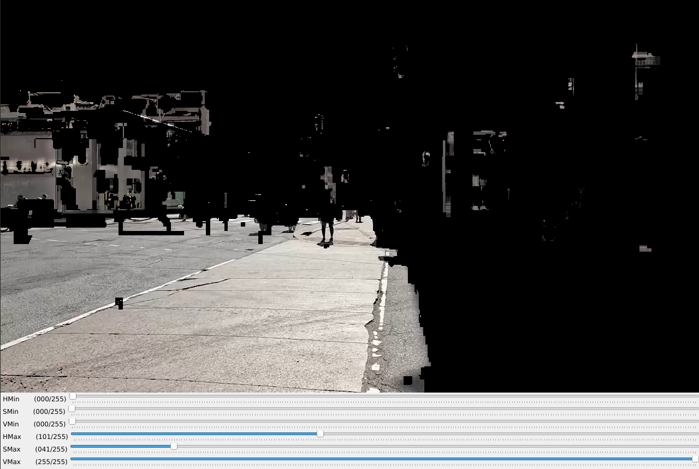

# Path masking via color blob
## Overview

This project provides a set of Python scripts to detect and highlight specified paths in video frames using color blob detection. The primary focus is on identifying regions of interest based on specific color ranges, detecting contours, and visualizing the results.

## Features

- Interactive adjustment of HSV color thresholds using trackbars.
- Real-time video processing to detect and highlight navigable paths.
- Extraction of dominant floor colors to dynamically adapt detection thresholds.
- Visualization of detected paths and key regions for debugging and analysis.

## Usage

1. **Run `color_helper.py`**: Execute the `color_helper.py` script to interactively adjust the HSV color thresholds and find the optimal values for your specific path detection needs. Pause and play ('p') to check sufficient ranges between frames.
    ```bash
    python color_helper.py
    ```
2. **Note the HSV values**: Once you have found the optimal HSV values using the trackbars, note them down.
3. **Set HSV values in `color_blob.py`**: Update the `hsv_min` and `hsv_max` variables in the `color_blob.py` script with the noted HSV values.
4. **Run `color_blob.py`**: Execute the `color_blob.py` script to process the video file specified in the `video_path` variable.
    ```bash
    python color_blob.py
    ```
5. **Pause/Resume**: Press 'p' to pause or resume the video processing.
6. **Quit**: Press 'q' to quit the application.

## Demo

Below are some images demonstrating the application in action. The images show the original frame on the top half and the processed frame with the applied mask on the bottom half.

### Sidewalk Detection


### Toronto Video Frame 1


### Toronto Video Frame 2


### Toronto Video Frame 3


Color_helper.py application:

### Color Tool



## Dependencies

- OpenCV (cv2)
- NumPy

## Instructions

1. Install the required dependencies:
    ```bash
    pip install opencv-python numpy
    ```
2. Run the script:
    ```bash
    python color_helper.py
    ```

## License

This project is licensed under the MIT License.
